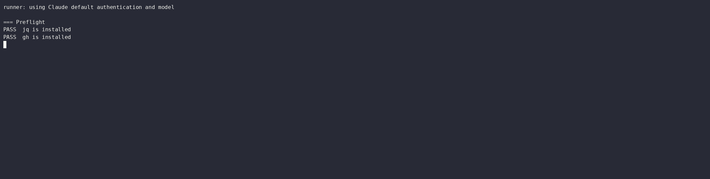
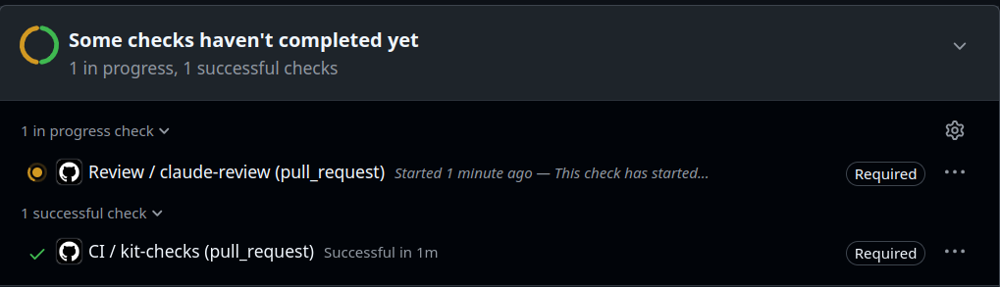
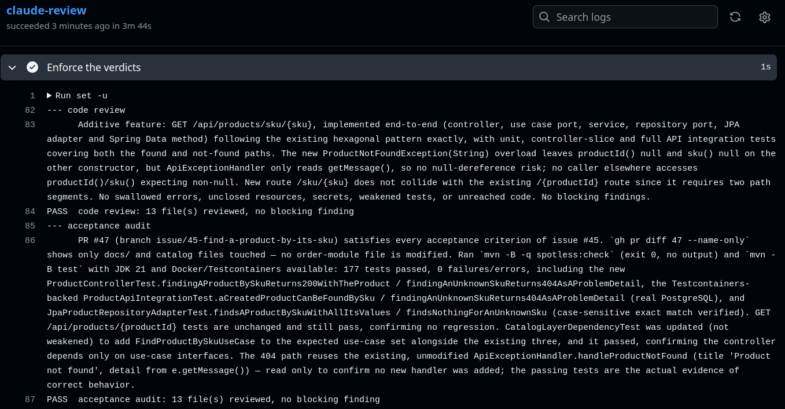
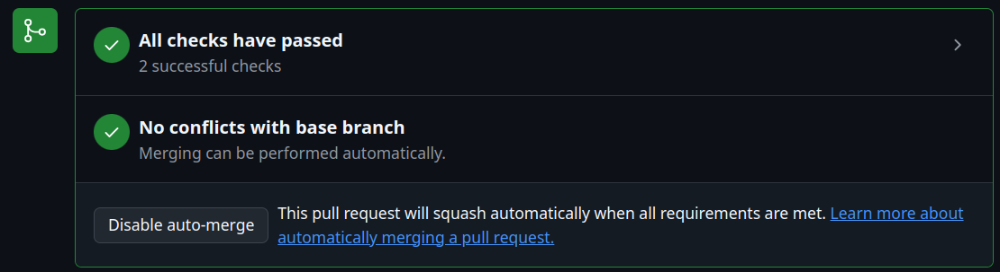
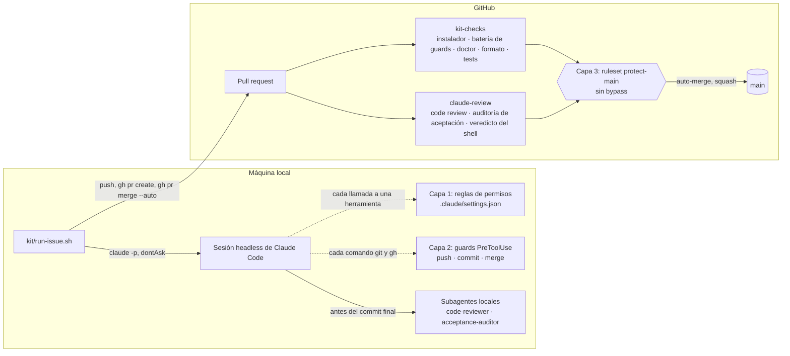
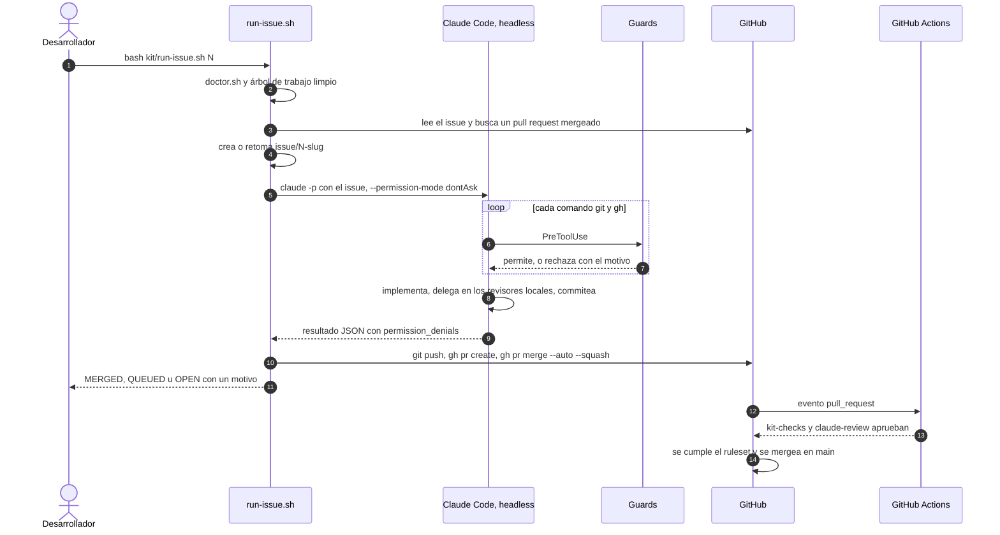

<div align="center">

# gated-agent-workflow

**Un kit que se instala en cualquier repositorio para que Claude Code resuelva issues de GitHub sin supervisión, mientras el merge a `main` queda detrás de checks que el agente no puede desactivar.**

[](https://github.com/RodolGiaco/gated-agent-workflow/actions/workflows/kit-ci.yml)
[](LICENSE)


[English](README.md) · **Español**

</div>

## Contenido

- [Descripción](#descripción)
- [Demo](#demo)
- [Características](#características)
- [Stack tecnológico](#stack-tecnológico)
- [Arquitectura](#arquitectura)
- [Estructura del proyecto](#estructura-del-proyecto)
- [Instalación y uso](#instalación-y-uso)
- [Verificación](#verificación)
- [Decisiones técnicas](#decisiones-técnicas)
- [Límites conocidos](#límites-conocidos)
- [Documentación](#documentación)
- [Autor](#autor)
- [Licencia](#licencia)

## Descripción

Un agente autónomo puede escribir más código del que una persona alcanza a revisar al ritmo en que lo escribe. Revisar cada commit convierte a la persona en el cuello de botella; no revisar nada es renunciar al control. Este kit mueve el punto de control al único lugar donde no hace falta que nadie esté presente: el merge.

Dentro de la rama de un issue, Claude Code implementa, commitea y pushea sin pedir permiso, porque esa rama es descartable. La rama protegida cambia únicamente mediante un pull request que GitHub mergea cuando pasan dos checks obligatorios: uno ejecuta el build, los tests y la verificación propia del kit; el otro es una revisión donde dos revisores de Claude juzgan el cambio y un script de shell, no el modelo, decide si aprobaron. El ruleset no admite bypass, así que ni siquiera el dueño del repositorio puede omitirlo.

Todo lo que el kit distribuye vive en [`kit/`](kit): copiar ese único directorio y ejecutar el instalador configura el ciclo completo en otro repositorio. Este repositorio también contiene la aplicación de referencia que el ciclo construye issue por issue, una API de gestión de pedidos en Spring Boot, que le da al agente trabajo real con tests reales que pasar.

## Demo

Una ejecución real del [issue #45](https://github.com/RodolGiaco/gated-agent-workflow/issues/45), que agrega a la aplicación de referencia la búsqueda de un producto por SKU, desde el comando hasta el merge.

**1. Un comando resuelve el issue.** El runner revisa la instalación, crea la rama, deja que una sesión headless implemente el issue, pushea, abre el pull request y encola el merge.



**2. Los dos checks son obligatorios.** El ruleset no mergea hasta que pasan `kit-checks` y `claude-review`.



**3. El shell decide el veredicto.** Los dos revisores respondieron, y el paso `Enforce the verdicts` aceptó cada respuesta.



**4. GitHub mergea.** Cuando se cumplen todos los requisitos, el auto-merge integra el pull request en `main` con squash; nadie aprieta el botón.



## Características

- 🚀 **Un comando por issue.** `bash kit/run-issue.sh <n>` crea o retoma la rama del issue, ejecuta una sesión headless de Claude Code, pushea, abre el pull request y encola el merge. Cada ejecución termina en un resultado declarado, `MERGED` o `QUEUED`, o en una detención con su motivo y un código de salida distinto de cero, y nunca informa un éxito que no observó.
- 🏛️ **Una barrera que el agente no puede desactivar.** Un ruleset de GitHub sobre la rama protegida exige un pull request y dos status checks, prohíbe borrar la rama y hacer force push, y no admite bypass de nadie.
- 🔐 **Checks atados a quien los publica.** Cada check obligatorio está vinculado a la app de GitHub Actions, así que nadie con permiso de escritura, el agente incluido, puede publicar un estado en verde por su cuenta.
- 🪝 **Guards que analizan en lugar de buscar palabras.** Hooks PreToolUse leen cada comando por posición y deciden sobre el estado real del repositorio. Rechazan los push que apuntan a `main`, incluidos `HEAD:main`, `+main`, `git -C . push`, un push envuelto en `timeout` y `main;` pegado a un separador, además de los force push, los commits fuera de una rama de trabajo y los merges sin `--auto`. El motivo le llega al modelo en el mismo turno.
- ⚖️ **Una revisión doble en CI.** Un revisor de código y un auditor de aceptación corren en GitHub Actions y responden con JSON validado contra un esquema; un paso de shell, no el modelo, decide si cada uno aprobó.
- 🔁 **Ejecuciones que se retoman.** Una ejecución que falla a mitad de camino deja su rama, y la siguiente continúa desde ahí. Una base desactualizada, o un issue cuyo pull request ya se mergeó, detiene la ejecución antes de pagar una sesión.
- 🧭 **Contexto que sobrevive a la compactación.** Un hook SessionStart repite la política de ramas y el issue en curso al iniciar, al retomar y después de cada compactación.
- 🧪 **Verificación offline.** `kit/test-guards.sh` ejecuta 63 casos de hooks en repositorios descartables sin iniciar una sesión de Claude, y `kit/doctor.sh` revisa la instalación, su consistencia y el ruleset vigente en el servidor.
- 🧾 **Registro de cada rechazo.** Cada rechazo de un guard se agrega a `.claude/logs/guard-denials.jsonl`: la evidencia para decidir si un guard sigue justificando su lugar.
- 🔀 **Cambio de proveedor.** `USE_OPENROUTER=true` en `.env.local` hace que la sesión headless pase por OpenRouter, para que el ciclo siga funcionando cuando se agota la cuota de la suscripción.
- 📦 **Se instala con una copia.** Todo lo que el kit distribuye vive en `kit/`, y un único archivo, `.claude/kit.vars`, guarda cada valor propio del proyecto.

## Stack tecnológico

**El kit**

| Tecnología | Versión | Para qué se usa |
|---|---|---|
| Claude Code | — | Sesiones headless (`claude -p`), hooks PreToolUse y SessionStart, subagentes de revisión |
| `anthropics/claude-code-action` | v1 | Ejecuta los dos revisores dentro de GitHub Actions con salida estructurada |
| GitHub Actions | — | Los checks obligatorios `kit-checks` y `claude-review` |
| Rulesets de GitHub | — | La barrera del lado del servidor sobre la rama protegida |
| GitHub CLI (`gh`) | — | Issues, pull requests, auto-merge y verificación del ruleset |
| Bash | — | Guards, instalador, runner y doctor |
| jq | — | Entrada y salida de los hooks, estado de la sesión y lectura de veredictos |

**La aplicación de referencia**

| Tecnología | Versión | Para qué se usa |
|---|---|---|
| Java | 21 | Lenguaje y runtime |
| Spring Boot | 4.1.1 | Web MVC, Data JPA, Bean Validation y Actuator |
| Hibernate ORM | 7.4.5 | Proveedor JPA detrás de los adaptadores de persistencia |
| PostgreSQL | 17 | Base de datos; el catálogo guarda sus tablas en un esquema propio |
| Flyway | 12.4.0 | Migraciones versionadas, con un historial separado por módulo |
| JUnit Jupiter | 6.0 | Tests unitarios, de la capa web y de integración |
| Mockito | 5.23 | Reemplaza a los casos de uso en los tests de la capa web |
| Testcontainers | 2.0.5 | PostgreSQL descartable para los tests de integración |
| Spotless con google-java-format | 2.44.4 | Chequeo de formato en CI |

## Arquitectura

El kit envuelve una sesión headless de Claude Code en tres capas de control. Las dos primeras corren en la máquina local y dan feedback; la tercera corre en GitHub y es la única barrera.



| Capa | Dónde corre | Para qué sirve | ¿Puede evadirla el agente? |
|---|---|---|---|
| 1. Reglas de permisos | Máquina local | Absolutos: comandos que no tienen ninguna forma válida dentro del ciclo | Sí: un script que envuelve un comando denegado lo ejecuta igual |
| 2. Guards PreToolUse | Máquina local | Condiciones que una regla de texto no puede expresar, como qué rama está activa | Sí: `disableAllHooks` o `--bare` los desactivan |
| 3. Ruleset de GitHub | GitHub | La barrera: pull request, sin borrado, sin force push, dos checks obligatorios | No |

Las capas locales no son un límite de seguridad, y el kit no las trata como tal. Lo que aportan es feedback dentro del turno: cuando un guard rechaza algo, el motivo le llega al modelo, que corrige el rumbo en el momento en lugar de fallar veinte minutos después en CI.

### La revisión en CI

Los revisores corren en GitHub Actions y no en la sesión local: un veredicto publicado desde la sesión local correría con la identidad del desarrollador, y el agente podría aprobar su propio trabajo.

- **El revisor de código** juzga el cambio sin saber por qué se tomó cada decisión, y eso es lo que le permite encontrar lo que el autor se convenció de pasar por alto.
- **El auditor de aceptación** ignora la calidad del código y comprueba, criterio por criterio, que lo que pidió el issue está presente y funciona. Leer código que parece implementar un criterio no es evidencia; un comando que ejecutó, sí.

Cada uno responde con salida estructurada validada contra un JSON schema. Un paso de shell aprueba a un revisor solo cuando se cumplen las cinco condiciones:

1. La ejecución terminó.
2. Produjo una salida estructurada que se puede parsear.
3. Nombra al menos un archivo revisado.
4. Cada archivo que nombra forma parte de este diff, contrastado con `git diff`.
5. Su veredicto es coherente con sus hallazgos.

Todo modo de falla cae del lado del rechazo: una revisión que no se ejecutó nunca aprueba. Una rama sin número de issue, como la vía de mantenimiento `kit/<slug>`, no tiene issue que auditar, así que ahí solo aplica el code review.

### Un issue de punta a punta



[`kit/README.md`](kit/README.md) describe cada capa en profundidad (en inglés), incluido el porqué de cada regla deny y por qué las reglas que parecen faltar quedan fuera a propósito.

## Estructura del proyecto

```
.
├── kit/                     # el kit distribuible: el único directorio que se copia
│   ├── hooks/               # guards PreToolUse y el hook de contexto SessionStart
│   ├── agents/              # prompts de sistema de los dos revisores
│   ├── workflows/           # workflows de CI y de revisión, se instalan en .github/workflows
│   ├── github/              # ruleset de la rama y el script que lo aplica y verifica
│   ├── install.sh           # instala el kit en el repositorio desde donde se ejecuta
│   ├── doctor.sh            # verifica instalación, consistencia y el ruleset del servidor
│   ├── run-issue.sh         # resuelve un issue de punta a punta
│   ├── test-guards.sh       # batería de aceptación offline de los hooks
│   ├── settings.json        # reglas de permisos y registro de hooks
│   ├── kit.vars.example     # plantilla de las variables del proyecto
│   └── gitignore.fragment   # bloque que el instalador agrega a .gitignore
├── .claude/                 # copia instalada: revisores y kit.vars versionados, hooks generados
├── .github/workflows/       # copia instalada de los workflows
├── docs/                    # documentación extendida del kit y de la aplicación de referencia
├── src/                     # aplicación de referencia: API de gestión de pedidos en Spring Boot
├── pom.xml, mvnw            # build Maven de la aplicación de referencia
├── .env.example             # variables locales del runner y de la aplicación de referencia
├── CLAUDE.md                # instrucciones que lee cada sesión de Claude Code en este repositorio
└── LICENSE
```

## Instalación y uso

### Requisitos previos

- `git`, `jq` y GitHub CLI (`gh`), autenticado con `gh auth login`.
- Claude Code, con la sesión iniciada en una suscripción, para crear el token de revisión con `claude setup-token`.
- Un repositorio de GitHub con permisos de administración. En el plan gratuito, los rulesets requieren un repositorio **público**.

### Instalar el kit en un repositorio

Todos los comandos se ejecutan desde la raíz del repositorio destino.

1. Copiar el kit:
   ```bash
   git clone https://github.com/RodolGiaco/gated-agent-workflow.git /tmp/gated-agent-workflow
   cp -r /tmp/gated-agent-workflow/kit .
   ```
2. Instalarlo. Los archivos generados se reescriben en cada ejecución; los que se editan se crean una vez y nunca se sobrescriben. El instalador además marca el workspace como confiable: sin eso, una ejecución headless ignora las reglas allow y rechaza cada llamada a una herramienta.
   ```bash
   bash kit/install.sh
   ```
3. Completar los comandos del proyecto en `.claude/kit.vars`. Un valor vacío omite su paso. Para un proyecto Maven:
   ```bash
   KIT_JAVA_VERSION=21
   KIT_FORMAT_CHECK_CMD="mvn -B -q spotless:check"
   KIT_TEST_CMD="mvn -B test"
   ```
4. Crear el token con el que se autentica el workflow de revisión. Este paso es interactivo.
   ```bash
   claude setup-token
   gh secret set CLAUDE_CODE_OAUTH_TOKEN
   ```
5. Commitear el kit antes de aplicar la barrera, porque después la rama protegida solo cambia mediante un pull request:
   ```bash
   git add kit .claude/agents .claude/kit.vars .github/workflows .gitignore
   git commit -m "chore: install the gated agent workflow kit"
   git push origin main
   ```
6. Aplicar la barrera del servidor. El script vuelve a leer el resultado desde GitHub para verificarlo.
   ```bash
   bash kit/github/apply-protection.sh
   ```
7. Verificar la instalación completa:
   ```bash
   bash kit/doctor.sh
   ```

> [!IMPORTANT]
> En un repositorio sin ningún pull request mergeado, el paso 6 aplica el ruleset **sin** checks obligatorios: todavía no existe ninguna ejecución de checks a la cual vincularlos, y exigir un check que nunca reporta bloquearía cada pull request. Hay que repetir el paso 6 después de mergear el primer pull request; esa segunda pasada es la que vuelve obligatorios los checks.

### Trabajar un issue

```bash
bash kit/run-issue.sh <número-de-issue>
```

El cuerpo del issue es la especificación. Cada criterio de aceptación debe poder comprobarse con un comando o un test, porque esa es la única evidencia que acepta el auditor de aceptación.

### Configuración

| Dónde | Nombre | Para qué |
|---|---|---|
| `.claude/kit.vars` | `KIT_MAIN_BRANCH` | Rama protegida; `main` en la plantilla |
| | `KIT_ISSUE_BRANCH_PREFIX` | Las ramas de issue tienen la forma `<prefijo><número>-<slug>`; `issue/` en la plantilla |
| | `KIT_MAINTENANCE_BRANCH_PREFIX` | Vía para reparar el propio kit; `kit/` en la plantilla |
| | `KIT_JAVA_VERSION` | JDK que instala CI |
| | `KIT_FORMAT_CHECK_CMD` | Chequeo de formato que ejecuta CI |
| | `KIT_TEST_CMD` | Tests que ejecutan CI y el auditor de aceptación |
| Secret del repositorio | `CLAUDE_CODE_OAUTH_TOKEN` | Autentica el workflow de revisión |
| `.env.local` | `USE_OPENROUTER` | `true` hace pasar la sesión headless por OpenRouter, configurado en `~/.config/claude-code/openrouter.env` |

`.env.local` está ignorado por git, y [`.env.example`](.env.example) documenta cada variable que admite.

### Ejecutar la aplicación de referencia

<details>
<summary>La API de gestión de pedidos en <code>src/</code>, la que construye el ciclo de este repositorio</summary>

<br>

Requiere Java 21 y Docker.

1. Levantar PostgreSQL:
   ```bash
   docker run -d --name oms-postgres -e POSTGRES_DB=oms -e POSTGRES_USER=oms -e POSTGRES_PASSWORD=change-me -p 5432:5432 postgres:17
   ```
   Si el puerto 5432 ya está ocupado, por ejemplo por un PostgreSQL local, publicar otro, como `-p 5433:5432`, y en el paso siguiente definir también `OMS_DATABASE_URL=jdbc:postgresql://localhost:5433/oms`.
2. Crear `.env.local` a partir de la plantilla y definir en él `OMS_DATABASE_PASSWORD=change-me`:
   ```bash
   cp .env.example .env.local
   ```
3. Exportar las variables e iniciar la aplicación:
   ```bash
   set -a; . ./.env.local; set +a
   ./mvnw spring-boot:run
   ```
4. Comprobar que responde:
   ```bash
   curl http://localhost:8080/actuator/health
   ```

La suite de tests solo necesita Docker, que Testcontainers usa para levantar un PostgreSQL descartable: `./mvnw verify`.

</details>

## Verificación

El kit se verifica a sí mismo con scripts que cualquiera puede ejecutar. En un clon nuevo, primero hay que correr `bash kit/install.sh`: la batería y el doctor leen los hooks instalados.

| Comando | Qué comprueba |
|---|---|
| `bash kit/test-guards.sh` | 63 casos en repositorios descartables: cada forma de push, commit y merge que los guards deben permitir o rechazar, en una rama y en un detached HEAD, y el hook SessionStart. No inicia ninguna sesión de Claude. |
| `bash kit/doctor.sh` | Herramientas y autenticación, copias instaladas contra `kit/`, revisores, claves y comillas de `kit.vars`, rutas de permisos, hooks ejecutables, estado de sesión ignorado y un ruleset activo en GitHub. |
| `bash kit/github/apply-protection.sh` | Aplica el ruleset y lo vuelve a leer: activo, sin bypass, las tres reglas presentes, cada check vinculado a su app y el auto-merge activado. Requiere permisos de administración sobre el repositorio. |
| `./mvnw verify` | La aplicación de referencia: 177 tests, incluidos tests de integración contra PostgreSQL mediante Testcontainers. |

## Decisiones técnicas

- **El servidor es la única barrera.** Las reglas de permisos y los hooks corren en la máquina local y se pueden evadir: un script que envuelve un comando denegado lo ejecuta igual, y `disableAllHooks` o `--bare` desactivan los hooks. El kit mantiene el ruleset como punto de control, y `doctor.sh` falla cuando ningún ruleset activo protege la rama por defecto.
- **Reglas deny solo para absolutos.** Las reglas se evalúan en orden deny, ask, allow, y una regla deny no admite excepciones; por eso "nada de push a `main`, pero sí a la rama del issue" solo puede vivir en un hook. `claude`, `gh api`, `gh auth` y `gh repo delete` se deniegan sin más: un agente que puede iniciarse a sí mismo con los hooks desactivados, o llegar a la API cruda, se queda sin guards.
- **Analizar por posición, decidir sobre el estado.** Una búsqueda de palabras clave o bloquea `git commit -m "merge main"` o deja pasar `git -C . push origin main`. Los guards cortan el comando en los separadores del shell, omiten asignaciones y wrappers, encuentran el subcomando de git y leen la rama desde el repositorio. Un valor que no pueden resolver de forma estática, como `$BRANCH`, se rechaza.
- **Las revisiones corren donde el agente no está.** Los revisores corren en GitHub Actions con sus criterios leídos desde la rama protegida, así que un pull request no puede debilitar los criterios con los que se lo juzga.
- **El veredicto es del shell.** Los dos revisores corren en un solo job, porque un job omitido reporta éxito a un check obligatorio; si la auditoría aplica o no lo decide el shell, nunca un `if:` sobre un job.
- **El código de salida no es evidencia.** Una ejecución headless detenida por un rechazo de permisos igual reporta éxito, así que el runner lee `permission_denials` y cuenta commits, y cada mutación, desde el cambio de rama hasta el pedido de auto-merge, se vuelve a leer antes de darla por aplicada.
- **Un directorio, un archivo de variables.** Instalar el kit en otro repositorio es una copia y un script. Los archivos generados se ignoran y se reconstruyen; los revisores se versionan porque la acción de revisión los lee desde la rama protegida, y los workflows porque GitHub los ejecuta desde el repositorio.
- **Una aplicación real como banco de pruebas.** El ciclo trabaja sobre una API en Spring Boot con arquitectura hexagonal, migraciones con Flyway y tests con Testcontainers, así que el auditor de aceptación tiene comportamiento real que observar.

## Límites conocidos

- El veredicto de la revisión es el juicio de un modelo y puede variar sobre el mismo código. Lo que no depende del modelo es si la revisión se ejecutó y si su respuesta es coherente.
- `run-issue.sh` retoma una rama solo mientras la rama protegida no haya avanzado más allá de su base. El runner nunca rebasea ni mergea, así que una rama desactualizada se rehace a mano.
- Un kit instalado no se actualiza solo: cada repositorio conserva la copia que recibió. `doctor.sh` detecta diferencias entre `kit/` y los archivos instalados, no entre repositorios.
- Las ejecuciones headless autenticadas con un token de suscripción fallan cuando vence la sesión OAuth; una ejecución que no costó nada nunca llegó al modelo.
- El veredicto de un subagente no sobrevive a que el subagente muera a mitad de camino. `maxTurns` acota el daño; no lo elimina.
- El auditor de aceptación reporta cada criterio como no verificable mientras `KIT_TEST_CMD` esté vacío.
- Los rulesets en un repositorio privado requieren un plan pago de GitHub.

## Documentación

La documentación extendida está en inglés.

| Documento | Qué cubre |
|---|---|
| [`kit/README.md`](kit/README.md) | Las tres capas en profundidad, el porqué de cada regla deny y la configuración local del runner |
| [`docs/hooks.md`](docs/hooks.md) | Cómo leen un comando los guards, las reglas de cada guard y el hook SessionStart |
| [`docs/review-gate.md`](docs/review-gate.md) | Los dos checks obligatorios paso a paso, cómo se juzga un veredicto y cómo se vinculan los checks a su app |
| [`docs/troubleshooting.md`](docs/troubleshooting.md) | Cada mensaje de error del instalador, el doctor, el runner, el script de protección y la revisión, con su solución |
| [`docs/reference-application.md`](docs/reference-application.md) | Módulos, endpoints, formato de errores y persistencia de la API de gestión de pedidos |
| [`CLAUDE.md`](CLAUDE.md) | Lo que lee cada sesión de Claude Code en este repositorio: cómo mantener el kit y las convenciones de la aplicación |

## Autor

**Rodolfo Giacomodonatto**

- GitHub: [@RodolGiaco](https://github.com/RodolGiaco)
- LinkedIn: [rodolfo-giacomodonatto](https://www.linkedin.com/in/rodolfo-giacomodonatto)

## Licencia

Distribuido bajo la [licencia MIT](LICENSE).
