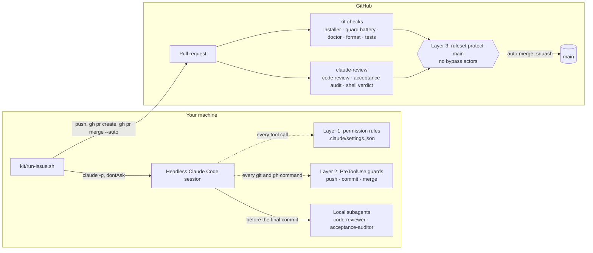
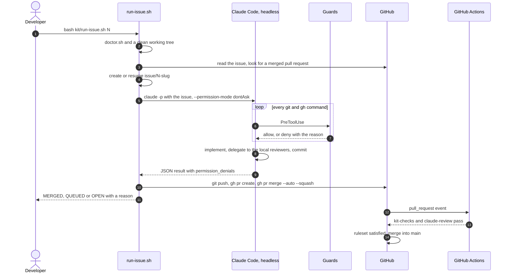

<div align="center">

# gated-agent-workflow

**A drop-in kit that lets Claude Code work GitHub issues unattended, while the merge into `main` stays behind checks the agent cannot switch off.**

[](https://github.com/RodolGiaco/gated-agent-workflow/actions/workflows/kit-ci.yml)
[](LICENSE)


**English** · [Español](README.es.md)

</div>

## Contents

- [Overview](#overview)
- [Demo](#demo)
- [Features](#features)
- [Tech stack](#tech-stack)
- [Architecture](#architecture)
- [Project structure](#project-structure)
- [Installation and usage](#installation-and-usage)
- [Verification](#verification)
- [Technical decisions](#technical-decisions)
- [Known limits](#known-limits)
- [Documentation](#documentation)
- [Author](#author)
- [License](#license)

## Overview

An autonomous agent can write more code than a person can review at the pace it writes it. Reviewing every commit makes the person the bottleneck; reviewing nothing gives up control. This kit moves the control point to the one place where nobody has to be present: the merge.

Inside an issue branch, Claude Code implements, commits and pushes without asking, because that branch is disposable. The protected branch changes only through a pull request that GitHub merges once two required checks pass: one runs the build, the tests and the kit's own verification; the other is a review gate where two Claude reviewers judge the change and a shell script, not the model, decides whether they passed. The ruleset has no bypass actors, so not even the repository owner can skip it.

Everything the kit ships lives under [`kit/`](kit): copying that one directory and running the installer sets up the whole cycle in another repository. This repository also contains the reference application the cycle builds one issue at a time, an order management API in Spring Boot, which gives the agent real work with real tests to pass.

## Demo

> [!NOTE]
> Captures to add. Each row names the file to place under `docs/images/` and what it should show.

| Capture | What it should show |
|---|---|
| `docs/images/run-issue.gif` | A terminal recording of `bash kit/run-issue.sh <n>`, from `Preflight` to the final `QUEUED` or `MERGED` line. |
| `docs/images/guard-refusal.png` | A session where the push guard refuses `git push origin main` and the model reads the reason in the same turn. |
| `docs/images/pull-request-checks.png` | A pull request opened by the runner, with `kit-checks` and `claude-review` required and auto-merge enabled. |
| `docs/images/review-verdicts.png` | The log of the `Enforce the verdicts` step, with a `PASS` line for the code review and one for the acceptance audit. |

## Features

- 🚀 **One command per issue.** `bash kit/run-issue.sh <n>` creates or resumes the issue branch, runs a headless Claude Code session, pushes, opens the pull request and queues the merge. Every run ends in a declared outcome, `MERGED` or `QUEUED`, or a stop with its reason and a non-zero exit code, and never reports a success it did not observe.
- 🏛️ **A barrier the agent cannot switch off.** A GitHub ruleset on the protected branch requires a pull request and two status checks, forbids deletion and force pushes, and has no bypass actors.
- 🔐 **Checks bound to their publisher.** Each required check is tied to the GitHub Actions app, so nobody with write access, the agent included, can publish a green status of their own.
- 🪝 **Guards that parse instead of grep.** PreToolUse hooks read each command by position and decide on the resolved repository state. They refuse pushes that target `main`, including `HEAD:main`, `+main`, `git -C . push`, a push wrapped in `timeout` and `main;` glued to a separator, as well as force pushes, commits outside a work branch and merges without `--auto`. The reason reaches the model in the same turn.
- ⚖️ **A two-reviewer gate in CI.** A code reviewer and an acceptance auditor run in GitHub Actions and answer with schema-validated JSON; a shell step, not the model, decides whether each one passed.
- 🔁 **Resumable runs.** A run that fails halfway leaves its branch behind, and the next run continues from it. A stale base, or an issue whose pull request already merged, stops the run before a session is paid for.
- 🧭 **Context that survives compaction.** A SessionStart hook restates the branch policy and the issue in progress on startup, on resume and after every compaction.
- 🧪 **Offline verification.** `kit/test-guards.sh` runs 58 hook cases in throwaway repositories without starting a Claude session, and `kit/doctor.sh` checks the installation, its consistency and the live server ruleset.
- 🧾 **A record of every refusal.** Each guard refusal is appended to `.claude/logs/guard-denials.jsonl`, the evidence for deciding whether a guard still earns its place.
- 🔀 **Provider switch.** `USE_OPENROUTER=true` in `.env.local` routes the headless session through OpenRouter, so the cycle keeps running when the subscription quota is spent.
- 📦 **One copy installs it.** Every file the kit ships lives under `kit/`, and a single file, `.claude/kit.vars`, holds every project-specific value.

## Tech stack

**The kit**

| Technology | Version | Used for |
|---|---|---|
| Claude Code | — | Headless sessions (`claude -p`), PreToolUse and SessionStart hooks, review subagents |
| `anthropics/claude-code-action` | v1 | Runs the two reviewers inside GitHub Actions with structured output |
| GitHub Actions | — | The `kit-checks` and `claude-review` required checks |
| GitHub rulesets | — | The server-side barrier on the protected branch |
| GitHub CLI (`gh`) | — | Issues, pull requests, auto-merge and ruleset verification |
| Bash | — | Guards, installer, runner and doctor |
| jq | — | Hook input and output, session state and verdict parsing |

**The reference application**

| Technology | Version | Used for |
|---|---|---|
| Java | 21 | Language and runtime |
| Spring Boot | 4.1.1 | Web MVC, Data JPA, Bean Validation and Actuator |
| Hibernate ORM | 7.4.5 | JPA provider behind the persistence adapters |
| PostgreSQL | 17 | Database; the catalog keeps its tables in a schema of its own |
| Flyway | 12.4.0 | Versioned migrations, with a separate history per module |
| JUnit Jupiter | 6.0 | Unit, web-layer and integration tests |
| Mockito | 5.23 | Stands in for the use cases in the web-layer tests |
| Testcontainers | 2.0.5 | Throwaway PostgreSQL for integration tests |
| Spotless with google-java-format | 2.44.4 | Formatting check in CI |

## Architecture

The kit wraps a headless Claude Code session in three layers of control. The first two run on your machine and give feedback; the third runs on GitHub and is the only barrier.



| Layer | Runs on | What it is for | Can the agent evade it? |
|---|---|---|---|
| 1. Permission rules | Your machine | Absolutes: commands that have no valid form in the cycle | Yes: a script that wraps a denied command runs it anyway |
| 2. PreToolUse guards | Your machine | Conditions a text rule cannot express, such as which branch is checked out | Yes: `disableAllHooks` or `--bare` turn them off |
| 3. GitHub ruleset | GitHub | The barrier: pull request, no deletion, no force push, two required checks | No |

The local layers are not a security boundary, and the kit does not treat them as one. What they buy is feedback inside the turn: when a guard refuses, the reason reaches the model, which corrects course immediately instead of failing twenty minutes later in CI.

### The review gate

The reviewers run in GitHub Actions rather than in the local session: a verdict published from the local session would run under your identity, and the agent could approve its own work.

- **The code reviewer** judges the change without knowing why any decision was made, which is what lets it find what the author talked itself past.
- **The acceptance auditor** ignores code quality and checks, criterion by criterion, that what the issue asked for is present and works. Reading code that appears to implement a criterion is not evidence; a command it ran is.

Each one answers with structured output validated against a JSON schema. A shell step passes a reviewer only when all five conditions hold:

1. The run completed.
2. It produced structured output that parses.
3. It names at least one file it reviewed.
4. Every file it names is part of this diff, checked against `git diff`.
5. Its verdict agrees with its findings.

Every failure mode lands on the refusing side: a review that did not run never passes. A branch without an issue number, such as the maintenance lane `kit/<slug>`, has no issue to audit, so only the code review applies there.

### One issue, end to end



[`kit/README.md`](kit/README.md) covers each layer in depth, including why every deny rule exists and why the rules that look missing are left out on purpose.

## Project structure

```
.
├── kit/                     # the distributable kit: the only directory to copy
│   ├── hooks/               # PreToolUse guards and the SessionStart context hook
│   ├── agents/              # system prompts of the two reviewers
│   ├── workflows/           # CI and review workflows, installed into .github/workflows
│   ├── github/              # branch ruleset and the script that applies and verifies it
│   ├── install.sh           # installs the kit into the repository it runs from
│   ├── doctor.sh            # verifies installation, consistency and the server ruleset
│   ├── run-issue.sh         # works one issue end to end
│   ├── test-guards.sh       # offline acceptance battery for the hooks
│   ├── settings.json        # permission rules and hook registration
│   ├── kit.vars.example     # template of the per-project variables
│   └── gitignore.fragment   # block the installer appends to .gitignore
├── .claude/                 # installed copy: reviewers and kit.vars versioned, hooks generated
├── .github/workflows/       # installed copy of the workflows
├── docs/                    # extended documentation of the kit and the reference application
├── src/                     # reference application: order management API in Spring Boot
├── pom.xml, mvnw            # Maven build of the reference application
├── .env.example             # local variables of the runner and the reference application
├── CLAUDE.md                # instructions every Claude Code session in this repository reads
└── LICENSE
```

## Installation and usage

### Prerequisites

- `git`, `jq` and the GitHub CLI (`gh`), authenticated with `gh auth login`.
- Claude Code, signed in with a subscription, to create the review token with `claude setup-token`.
- A GitHub repository you administer. On the free plan, rulesets require a **public** repository.

### Install the kit into a repository

Run every command from the root of the target repository.

1. Copy the kit:
   ```bash
   git clone https://github.com/RodolGiaco/gated-agent-workflow.git /tmp/gated-agent-workflow
   cp -r /tmp/gated-agent-workflow/kit .
   ```
2. Install it. Generated files are rewritten on every run; files you edit are created once and never overwritten. The installer also marks the workspace as trusted: without that, a headless run ignores the allow rules and refuses every tool call.
   ```bash
   bash kit/install.sh
   ```
3. Fill in the project commands in `.claude/kit.vars`. An empty value skips its step. For a Maven project:
   ```bash
   KIT_JAVA_VERSION=21
   KIT_FORMAT_CHECK_CMD="mvn -B -q spotless:check"
   KIT_TEST_CMD="mvn -B test"
   ```
4. Create the token the review workflow authenticates with. This step is interactive.
   ```bash
   claude setup-token
   gh secret set CLAUDE_CODE_OAUTH_TOKEN
   ```
5. Commit the kit before applying the barrier, because afterwards the protected branch only changes through a pull request:
   ```bash
   git add kit .claude/agents .claude/kit.vars .github/workflows .gitignore
   git commit -m "chore: install the gated agent workflow kit"
   git push origin main
   ```
6. Apply the server barrier. The script reads the result back from GitHub to verify it.
   ```bash
   bash kit/github/apply-protection.sh
   ```
7. Verify the whole installation:
   ```bash
   bash kit/doctor.sh
   ```

> [!IMPORTANT]
> On a repository with no merged pull request, step 6 applies the ruleset **without** required checks: no check run exists yet to bind them to, and requiring a check that never reports would block every pull request. Run step 6 again after the first pull request merges; that second pass makes the checks required.

### Work an issue

```bash
bash kit/run-issue.sh <issue-number>
```

The issue body is the specification. Write each acceptance criterion so that a command or a test can show it is met, because that is the only evidence the acceptance auditor accepts.

### Configuration

| Where | Name | Purpose |
|---|---|---|
| `.claude/kit.vars` | `KIT_MAIN_BRANCH` | Protected branch; `main` in the template |
| | `KIT_ISSUE_BRANCH_PREFIX` | Issue branches take the shape `<prefix><number>-<slug>`; `issue/` in the template |
| | `KIT_MAINTENANCE_BRANCH_PREFIX` | Lane for repairs to the kit itself; `kit/` in the template |
| | `KIT_JAVA_VERSION` | JDK that CI sets up |
| | `KIT_FORMAT_CHECK_CMD` | Format check that CI runs |
| | `KIT_TEST_CMD` | Tests that CI and the acceptance auditor run |
| Repository secret | `CLAUDE_CODE_OAUTH_TOKEN` | Authenticates the review workflow |
| `.env.local` | `USE_OPENROUTER` | `true` routes the headless session through OpenRouter, configured in `~/.config/claude-code/openrouter.env` |

`.env.local` is ignored by git, and [`.env.example`](.env.example) documents every variable it takes.

### Run the reference application

<details>
<summary>The order management API in <code>src/</code>, which the cycle in this repository builds</summary>

<br>

Requires Java 21 and Docker.

1. Start PostgreSQL:
   ```bash
   docker run -d --name oms-postgres -e POSTGRES_DB=oms -e POSTGRES_USER=oms -e POSTGRES_PASSWORD=change-me -p 5432:5432 postgres:17
   ```
   If port 5432 is already taken, for example by a local PostgreSQL, publish another one, such as `-p 5433:5432`, and in the next step also set `OMS_DATABASE_URL=jdbc:postgresql://localhost:5433/oms`.
2. Create `.env.local` from the template, then set `OMS_DATABASE_PASSWORD=change-me` in it:
   ```bash
   cp .env.example .env.local
   ```
3. Export the variables and start the application:
   ```bash
   set -a; . ./.env.local; set +a
   ./mvnw spring-boot:run
   ```
4. Check that it is up:
   ```bash
   curl http://localhost:8080/actuator/health
   ```

The test suite needs only Docker, which Testcontainers uses to start a throwaway PostgreSQL: `./mvnw verify`.

</details>

## Verification

The kit verifies itself with scripts anyone can run. In a fresh clone, run `bash kit/install.sh` first: the battery and the doctor read the installed hooks.

| Command | What it checks |
|---|---|
| `bash kit/test-guards.sh` | 58 cases in throwaway repositories: every push, commit and merge form the guards must allow or refuse, and the SessionStart hook. No Claude session is started. |
| `bash kit/doctor.sh` | Tools and authentication, installed copies against `kit/`, reviewers, `kit.vars` keys and quoting, permission paths, executable hooks, ignored session state, and an active ruleset on GitHub. |
| `bash kit/github/apply-protection.sh` | Applies the ruleset and reads it back: active, no bypass actors, the three rules present, each check bound to its app, auto-merge enabled. Needs admin rights on the repository. |
| `./mvnw verify` | The reference application: 169 tests, including integration tests against PostgreSQL through Testcontainers. |

## Technical decisions

- **The server is the only barrier.** Permission rules and hooks run on your machine and can be evaded: a script that wraps a denied command runs it anyway, and `disableAllHooks` or `--bare` turn the hooks off. The kit keeps the ruleset as the control point, and `doctor.sh` fails when no active ruleset protects the default branch.
- **Deny rules only for absolutes.** Rules are evaluated deny, then ask, then allow, and a deny rule carries no exceptions, so "no push to `main`, but push to the issue branch" can only live in a hook. `claude`, `gh api`, `gh auth` and `gh repo delete` are denied outright: an agent that can start itself with hooks disabled, or reach the raw API, has no guards left.
- **Parse by position, decide on state.** A keyword search either blocks `git commit -m "merge main"` or misses `git -C . push origin main`. The guards split the command at shell separators, skip assignments and wrappers, find the git subcommand and read the branch from the repository. A value they cannot resolve statically, such as `$BRANCH`, is refused.
- **Reviews run where the agent is not.** The reviewers run in GitHub Actions with their criteria read from the protected branch, so a pull request cannot weaken the criteria it is judged by.
- **The shell owns the verdict.** Both reviewers run in one job, because a skipped job reports success to a required check; whether the audit applies is decided by the shell, never by an `if:` on a job.
- **Exit codes are not evidence.** A headless run stopped by a permission refusal still reports success, so the runner reads `permission_denials` and counts commits, and every mutation, from the branch switch to the auto-merge request, is read back before it counts as applied.
- **One directory, one variables file.** Installing the kit elsewhere is one copy and one script. Generated files are ignored and rebuilt; the reviewers are versioned because the review action reads them from the protected branch, and the workflows because GitHub runs them from the repository.
- **A real application as the test bed.** The cycle works on a Spring Boot API with a hexagonal layout, Flyway migrations and Testcontainers tests, so the acceptance auditor has real behaviour to observe.

## Known limits

- The review verdict is a model's judgment and can vary on identical code. What does not depend on the model is whether the review ran and whether its answer holds together.
- `run-issue.sh` resumes a branch only while the protected branch has not moved past its base. The runner never rebases or merges, so a stale branch is rebuilt by hand.
- An installed kit does not update itself: a repository keeps the copy it received. `doctor.sh` detects drift between `kit/` and the installed files, not between repositories.
- Headless runs authenticated with a subscription token fail when the OAuth session expires; a run that cost nothing never reached the model.
- A subagent verdict does not survive the subagent dying mid-pass. `maxTurns` caps the damage; it does not remove it.
- The acceptance auditor reports every criterion as unverifiable while `KIT_TEST_CMD` is empty.
- Rulesets on a private repository require a paid GitHub plan.

## Documentation

| Document | What it covers |
|---|---|
| [`kit/README.md`](kit/README.md) | The three layers in depth, why every deny rule exists, and the runner's local settings |
| [`docs/hooks.md`](docs/hooks.md) | How the guards read a command, the rules of each guard, and the SessionStart hook |
| [`docs/review-gate.md`](docs/review-gate.md) | The two required checks step by step, how a verdict is judged, and how the checks are bound to their app |
| [`docs/troubleshooting.md`](docs/troubleshooting.md) | Every failure message of the installer, the doctor, the runner, the protection script and the review gate, with its fix |
| [`docs/reference-application.md`](docs/reference-application.md) | Modules, endpoints, error format and persistence of the order management API |
| [`CLAUDE.md`](CLAUDE.md) | What every Claude Code session in this repository reads: how to maintain the kit, and the conventions of the application |

## Author

**Rodolfo Giacomodonatto**

- GitHub: [@RodolGiaco](https://github.com/RodolGiaco)
- LinkedIn: [rodolfo-giacomodonatto](https://www.linkedin.com/in/rodolfo-giacomodonatto)

## License

Released under the [MIT License](LICENSE).
