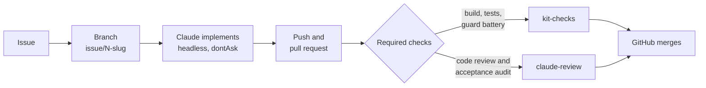

# gated-agent-workflow

Claude Code works GitHub issues on its own, inside a branch. The merge into the protected branch stays out of its reach.

This repository holds two things: a reusable **kit** that installs that cycle into any repository, and an **order management API** in Spring Boot that the cycle builds issue by issue.

## Why

An agent can produce more code than a person can review at the pace it produces it. Reviewing every commit makes the person the bottleneck; reviewing nothing removes control.

The kit moves the control point from where you have to be present to where you do not. Inside the issue branch the agent commits and pushes without asking: that branch is disposable. At the merge into the protected branch, the gate is opened by GitHub after deterministic checks pass, not by the model's good behaviour and not by a person reading a diff.

## The cycle



One command runs an issue end to end:

```bash
bash kit/run-issue.sh <issue-number>
```

The run ends in exactly one declared state: merged, queued, or open with a reason and a non-zero exit code. It never reports success it did not observe.

## Three layers, and what each one actually guarantees

Two of the three are evadable. Saying so plainly is what keeps the third one from being weakened.

| Layer | Where it runs | What it is for | Evadable |
|---|---|---|---|
| Permission rules | Your machine | Absolutes: what never has a valid form | Yes, a script that wraps a denied command runs it anyway |
| PreToolUse hooks | Your machine | Conditions a text rule cannot express, such as which branch you are on | Yes, `disableAllHooks` or `--bare` turn them off |
| GitHub ruleset | The server | The only barrier the model cannot switch off | No |

**Layer 1** is evaluated deny, then ask, then allow, first match wins, and a deny rule cannot carry exceptions. That is why it cannot express "no push to the protected branch, but push to the issue branch".

**Layer 2** exists for exactly those exceptions. The guards parse the command by position instead of searching it for keywords, and decide on resolved repository state. They are not a security boundary. Their value is **feedback inside the turn**: the refusal reason reaches the model, which corrects itself instead of failing twenty minutes later in CI.

**Layer 3** requires a pull request, forbids deletion and force push, and requires two status checks. Nobody can bypass it, including the repository owner. Each required check is bound to the app that publishes it, because otherwise anyone with write access, the agent included, could publish its own green status.

## The review gate

Two reviewers run inside GitHub Actions, not in the local session. If the local session published the verdict, the agent would run under your identity and could approve itself.

- **Code reviewer** judges the change without knowing why any decision was made, which is what lets it find what the author talked itself past.
- **Acceptance auditor** ignores code quality and checks, criterion by criterion, that what the issue asked for is present and works. Its rule: reading code that appears to implement something is not evidence.

The verdict comes back as schema-validated structured output. A shell step, never the model, decides the exit code, and a reviewer passes only when all five hold:

1. The run completed.
2. It produced structured output that parses.
3. It names at least one file it reviewed.
4. Every file it names is part of this diff, checked against `git diff`.
5. Its verdict agrees with its findings.

Every failure mode lands on the refusing side. A review that did not run never passes.

## What was measured

Every claim in this repository has a measurement behind it. None of the defects below was found by reading code.

| Claim | Evidence |
|---|---|
| The server refuses a direct push to the protected branch | `push declined due to repository rule violations` |
| The guards resolve every documented push form correctly | 56 acceptance cases, run offline without a session |
| The review gate is stable enough to require | 12 of 13 runs on clean pull requests |
| The acceptance auditor verifies real domain work | A REST API issue: 80 of 80 tests run and observed, not inferred |
| The kit installs outside this repository | Installed into a separate Spring Boot repository with no prior setup |

The first version of the push guard let seven forms of pushing to the protected branch through, including `git -C . push origin main`, `git push origin +main` and `git push origin main; ls`. The first version of the review gate failed five times in seven on clean content, because the model skipped the one expensive step of a multi-step prompt. Both are documented, along with how they were fixed.

## Install into another repository

Requirements: `git`, `gh` authenticated, `jq`, and Claude Code. Branch rulesets need a **public repository** on a free plan.

```bash
# 1. Copy the kit. Everything it ships lives under kit/.
cp -r path/to/gated-agent-workflow/kit .

# 2. Install. Rewrites generated files, never overwrites the ones you edit,
#    and trusts the workspace so headless runs can apply permission rules.
bash kit/install.sh

# 3. Fill in the project commands. Empty values skip the step.
$EDITOR .claude/kit.vars

# 4. Create the token the review workflow uses. This step is interactive.
claude setup-token
gh secret set CLAUDE_CODE_OAUTH_TOKEN

# 5. Commit before applying the barrier: afterwards the protected branch
#    only changes through a pull request.
git add -A && git commit -m "chore: install the autonomous issue cycle kit"
git push origin main

# 6. Apply the server barrier and verify it.
bash kit/github/apply-protection.sh

# 7. Verify the whole installation.
bash kit/doctor.sh
```

On a repository with no merged pull request, step 6 applies the ruleset **without** required checks: no check run has been published yet, so there is no app id to bind them to, and requiring a check that never reports would block every pull request. **Run step 6 again after the first pull request merges.** That second pass is what makes the checks required.

## Known limits

- The review verdict is still a model's judgment, so it can vary on identical code. What no longer depends on the model is producing the evidence.
- `run-issue.sh` is not idempotent. A run that fails halfway leaves its branch behind, and the branch has to be removed before retrying.
- There is no update mechanism. A repository where the kit is installed keeps the copy it received; `doctor.sh` detects drift between `kit/` and the installed files, but not between two repositories.
- Headless runs authenticated with a subscription token can fail when the OAuth session expires. A run that cost nothing never reached the model.
- A branch cut before a recent merge produces a diff that looks like a revert of that merge, and the code reviewer will block it. Branch from an up-to-date protected branch.

## Repository layout

```
kit/                    the distributable kit; the only directory you copy
  hooks/                PreToolUse guards and the SessionStart context hook
  agents/               system prompts of the two reviewers
  workflows/            the CI and review workflows
  github/               the branch ruleset and the script that applies it
  install.sh            installs the kit into the repository it runs from
  doctor.sh             verifies installation, consistency and the barrier
  run-issue.sh          runs one issue end to end
  test-guards.sh        offline acceptance battery for the guards
.claude/                installed copy; hooks and settings are generated
.github/workflows/      installed copy of the workflows
src/                    the order management API
```

## The application

An order management system built as a modular monolith with a hexagonal layout: domain, application, infrastructure and API kept apart, so business rules do not depend on Spring, JPA or HTTP. Java 21 and Spring Boot 4.1.1, with REST endpoints validated by Jakarta Validation and errors returned as `ProblemDetail`.

It grows one issue at a time, each one worked by the cycle above.

## Further reading

`kit/README.md` covers each layer in depth, including the justification for every deny rule, and why the rules that look missing were left out on purpose.
