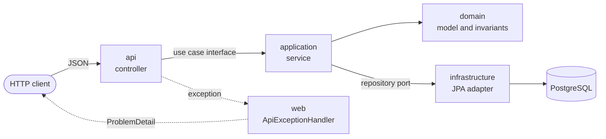

# Reference application

The order management API in [`src/`](../src) is the project the cycle in this repository builds, one issue at a time. It gives the agent realistic work, with domain invariants, persistence, HTTP contracts and tests that run against a real database, so the acceptance auditor has behaviour to observe.

## Contents

- [Modules](#modules)
- [Request flow](#request-flow)
- [Endpoints](#endpoints)
- [Errors](#errors)
- [Persistence](#persistence)
- [Configuration](#configuration)
- [Tests](#tests)

## Modules

| Module | Package | Owns |
|---|---|---|
| Orders | `io.github.rodolgiaco.oms.order` | Orders and their items, in the tables `orders` and `order_items` of the default schema |
| Catalog | `io.github.rodolgiaco.oms.catalog` | Products, in the table `products` of the `catalog` schema |
| Web | `io.github.rodolgiaco.oms.web` | `ApiExceptionHandler`, which turns every error into a `ProblemDetail` |

The two domain modules do not depend on each other: an order item carries the product identifier and the unit price the client sends.

Each domain module follows the same hexagonal layout:

| Layer | Package | Holds |
|---|---|---|
| API | `api` | Controller, request and response records, and the mapper between them and the application |
| Application | `application` | Service implementing the use cases, and the business exceptions |
| Input ports | `application.port.in` | One interface per use case, and its command |
| Output port | `application.port.out` | The repository interface the service stores through |
| Domain | `domain` | Model and invariants, free of Spring and JPA |
| Persistence | `infrastructure.persistence` | JPA entities, Spring Data repository, the adapter that implements the output port, and its mapper |

## Request flow



Tests hold the boundaries in place. `OrderLayerDependencyTest` and `CatalogLayerDependencyTest` check which collaborators the API and application layers may hold, and `OrderDomainPersistenceIndependenceTest` and `CatalogDomainPersistenceIndependenceTest` check that no domain class carries a JPA or Hibernate annotation.

## Endpoints

| Method | Path | Body | Success | Errors |
|---|---|---|---|---|
| `POST` | `/api/products` | `sku`, `name`, `unitPrice` | `201` with the product and a `Location` header | `400` invalid body, `409` SKU already taken |
| `GET` | `/api/products/{productId}` | — | `200` with the product | `400` malformed identifier, `404` unknown identifier |
| `GET` | `/api/products?page=&size=` | — | `200` with one page, ordered by SKU | `400` when `page` is below 0 or `size` is outside 1–100 |
| `POST` | `/api/orders` | `items`, each with `productId`, `quantity`, `unitPrice` | `201` with the order and a `Location` header | `400` invalid body |
| `GET` | `/api/orders/{orderId}` | — | `200` with the order | `400` malformed identifier, `404` unknown identifier |
| `GET` | `/actuator/health` | — | `200` with `status` `UP` | — |

`page` defaults to 0 and `size` to 20.

The request records and the domain enforce the same rules:

| Field | Rule |
|---|---|
| `sku`, `name` | Not blank; the SKU is unique across the catalog |
| `unitPrice` | Present and greater than zero, at any scale |
| `items` | At least one, and none of them null |
| `productId` of an order item | Not blank |
| `quantity` | Present and greater than zero |

### Create a product

```bash
curl -i -X POST http://localhost:8080/api/products \
  -H "Content-Type: application/json" \
  -d '{"sku": "BOOK-001", "name": "Domain-Driven Design", "unitPrice": 54.90}'
```

```http
HTTP/1.1 201
Location: http://localhost:8080/api/products/938fc86d-42a4-400a-b569-60a65c76df78
Content-Type: application/json

{
  "productId": "938fc86d-42a4-400a-b569-60a65c76df78",
  "sku": "BOOK-001",
  "name": "Domain-Driven Design",
  "unitPrice": 54.90
}
```

### List products

```bash
curl "http://localhost:8080/api/products?page=0&size=2"
```

```json
{
  "products": [
    {
      "productId": "938fc86d-42a4-400a-b569-60a65c76df78",
      "sku": "BOOK-001",
      "name": "Domain-Driven Design",
      "unitPrice": 54.90
    }
  ],
  "page": 0,
  "size": 2,
  "totalElements": 1,
  "totalPages": 1
}
```

### Create an order

```bash
curl -i -X POST http://localhost:8080/api/orders \
  -H "Content-Type: application/json" \
  -d '{"items": [{"productId": "BOOK-001", "quantity": 2, "unitPrice": 54.90},
                 {"productId": "PEN-002", "quantity": 3, "unitPrice": 1.20}]}'
```

```http
HTTP/1.1 201
Location: http://localhost:8080/api/orders/fa8c6770-545f-4a6f-8f64-d14475fad4db
Content-Type: application/json

{
  "orderId": "fa8c6770-545f-4a6f-8f64-d14475fad4db",
  "status": "CREATED",
  "items": [
    {"productId": "BOOK-001", "quantity": 2, "unitPrice": 54.90},
    {"productId": "PEN-002", "quantity": 3, "unitPrice": 1.20}
  ],
  "totalAmount": 113.40
}
```

`totalAmount` is the sum of `quantity × unitPrice` over the items.

## Errors

Every error is a `ProblemDetail` (RFC 9457) with `title`, `status`, `detail` and `instance`.

| Cause | Status | Title |
|---|---|---|
| A body that breaks a constraint | `400` | `Bad Request`, with an `errors` list |
| Items the order domain refuses | `400` | `Invalid order` |
| Values the catalog domain refuses | `400` | `Invalid product` |
| A malformed identifier or query parameter | `400` | `Bad Request` |
| An unknown order | `404` | `Order not found` |
| An unknown product | `404` | `Product not found` |
| A SKU that another product holds | `409` | `Duplicate SKU` |

A constraint violation lists each offending field:

```json
{
  "detail": "Invalid request content.",
  "instance": "/api/products",
  "status": 400,
  "title": "Bad Request",
  "errors": [
    {"field": "unitPrice", "message": "must be greater than 0"},
    {"field": "sku", "message": "must not be blank"}
  ]
}
```

The messages follow the request's `Accept-Language` header, and the default locale of the JVM when there is none.

A duplicate SKU is refused whether the service finds it before the write or the unique constraint raises it because two requests raced:

```json
{
  "detail": "a product with the SKU BOOK-001 already exists",
  "instance": "/api/products",
  "status": 409,
  "title": "Duplicate SKU"
}
```

## Persistence

- Flyway owns the schema. Hibernate only validates the entities against it (`spring.jpa.hibernate.ddl-auto=validate`), and `open-in-view` is off.
- The orders tables come from `src/main/resources/db/migration`, applied by the Flyway that Spring Boot configures, with its history in the default schema.
- The catalog table comes from `src/main/resources/db/catalog`, applied into the `catalog` schema, with a history of its own, by `CatalogSchemaConfiguration`, which runs before Hibernate validates the entities.
- Amounts are `NUMERIC` with no precision or scale: the domain accepts any positive `BigDecimal`, and a fixed scale would round a price such as `0.005` to `0.00`.
- Check constraints repeat the domain invariants in the database: positive quantities and prices, non-blank identifiers and names, and a unique SKU.

## Configuration

| Variable | Default | Purpose |
|---|---|---|
| `OMS_DATABASE_URL` | `jdbc:postgresql://localhost:5432/oms` | JDBC URL of the database |
| `OMS_DATABASE_USERNAME` | `oms` | Database user |
| `OMS_DATABASE_PASSWORD` | none, it is required | Database password |

The [README](../README.md#run-the-reference-application) has the steps to run the application with these variables.

## Tests

`./mvnw verify` runs 169 tests. The ones that need a database start PostgreSQL 17 in a container through Testcontainers, so Docker is the only requirement.

| Layer | Tests |
|---|---|
| Domain | Plain unit tests over every invariant |
| Application | Unit tests of each service over an in-memory implementation of its output port |
| API | `@WebMvcTest` slices with the use cases replaced by Mockito mocks, and end-to-end tests through MockMvc against the real database |
| Persistence | Adapter and schema tests against PostgreSQL, and plain tests of the entity mappers |
| Architecture | Reflection tests over the collaborators of each layer and the annotations of the domain |
